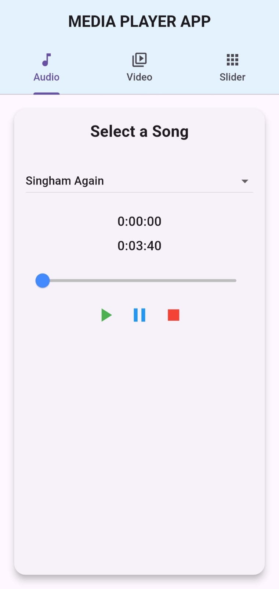
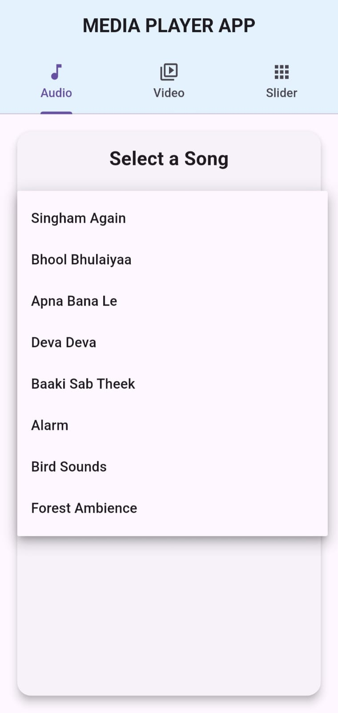
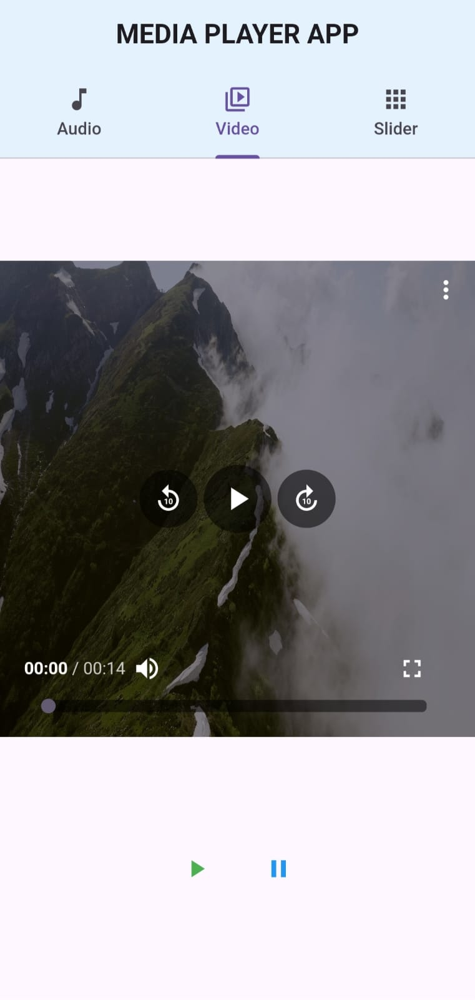
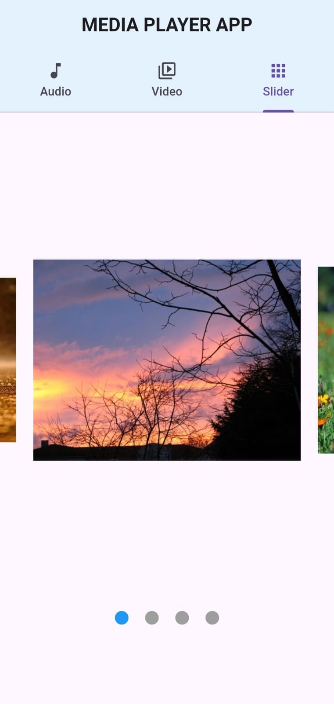

# 🎵 Media Player App 🎥

Welcome to the **Media Player App**! This app allows you to enjoy your favorite audio and video content with ease. Whether you're listening to music or watching videos, our app provides a seamless experience.

## � Features

- **Audio Playback**: Listen to your favorite songs with high-quality audio playback.
- **Video Playback**: Watch videos with smooth and clear video playback.
- **Slider Control**: Easily navigate through your media with a user-friendly slider.
- **Song Selection**: Choose from a variety of songs available in the app.
- **Tab Bar Navigation**: Switch between different sections of the app effortlessly using the intuitive tab bar.

## 🎶 Available Songs

Here are some of the songs you can enjoy in the app:

- 🎤 Singham Again
- 🎤 Bhool Bhulaiyaa
- 🎤 Apna Bana Le
- 🎤 Deva Deva
- 🎤 Baaki Sab Theek
- ⏰ Alarm
- 🐦 Bird Sounds
- 🌳 Forest Ambience

## 🖼️ Screenshots

Check out some screenshots of the app in action:










## 🚀 Getting Started

To get started with the Media Player App, simply download and install the app on your device. Open the app, select your desired media, and enjoy!

## 🔧 Clone the Repo

To get a local copy of the project, follow these steps:

1. **Open your terminal or command prompt.**
2. **Clone the repository:**

   ```bash
   git clone https://github.com/your-username/media-player-app.git
Navigate to the project directory:

bash
Copy
cd media-player-app
Install dependencies (if any):

bash
Copy
npm install
Run the app:

bash
Copy
npm start

📜 License
This project is licensed under the MIT License - see the LICENSE file for details.

Enjoy your media experience with the Media Player App! 🎉
